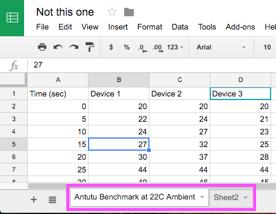
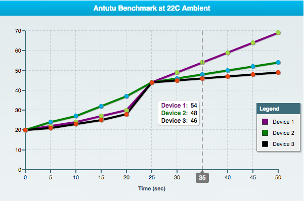

Importing From a Published Google Spreadsheet
---------------------------------------------

To import data from your Google Spreadsheet there are three easy steps that need to happen before you can use it in your charts.

1. You must publish your Google Spreadsheet to the web.
	- With your spreadsheet open select *File* and then click on *'Publish to the web...'*
	- Copy your spreadsheet's *key* which you can pull out of the URL as follows: `https://docs.google.com/spreadsheets/d/<Your Key>/edit#gid=0`
2. Include the script from this repo in your chart's html file. `<script src="js/zingchart-gss.js"`
3. To render your chart you will call the following function:

	```
	renderGoogleData ({
        key: '<Your Key>',
        id: '<Your Chart Id>',
        width: 600,
        height: 400,
        data: yourConfig
   });
	```

### Formatting the Spreadsheet
To specify a **chart title** set the 'sheet' label on your GSS like this:



To specify the x-axis labels, this will be the first column. As in the image above, the first column with 'Time (sec)' will be treated as the x-axis title and the subsequent data will be treated as the x-axis-labels.

In this case there are three series: Device 1, Device 2, and Device 3. The label for each series is that of the first entry in each of these columns. So if you instantiate a legend, the legend-items will be: 'Device 1', 'Device 2', 'Device 3'.

Here is a chart rendered from the sample spreadsheet above.



The config used to render this chart is as follows:

```
var myConfig = {
    type: 'line',
    legend: {
        header: {
            text: 'Legend'
        },
        draggable: true
    },
    crosshairX: {
        lineColor: "#565656",
        lineStyle: "dashed",
        lineWidth: 2,
        alpha: 0.5,
        plotLabel: { //label assoicated to data points
            backgroundColor: "#ffffff",
            borderColor: "#d2d2d2",
            borderRadius: "5px",
            bold: true,
            fontSize: "12px",
            fontColor: "#111",
            shadow: true,
            shadowDistance: 2,
            shadowAlpha: 0.4
        },
        scaleLabel: { //label associated to scaleX index
            bold: true,
            backgroundColor: "#787878",
            borderRadius: 3,
            fontColor: "#eaeaea",
            fontSize: "12px",
            callout: true,
            paddingTop: 2
        },
        marker: {
            visible: false //default
        }
    },
    series: [
     // values will always be overridden by GSS
     // anything else will have precedense over GSS
     {lineColor: 'purple', values:[1,2,3,4,5]},
     {lineColor: 'green', values:[2,3,4,5,6,7]},
     {lineColor: 'black', values:[3,4,5,6,7,8]}
    ],
    scaleX: {
        zooming: true,
        label: {
            _text: 'this will overwrite the GSS label'
        }
    }
};
```